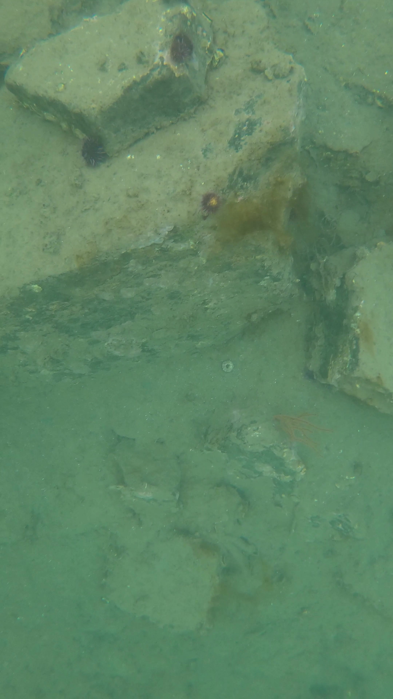
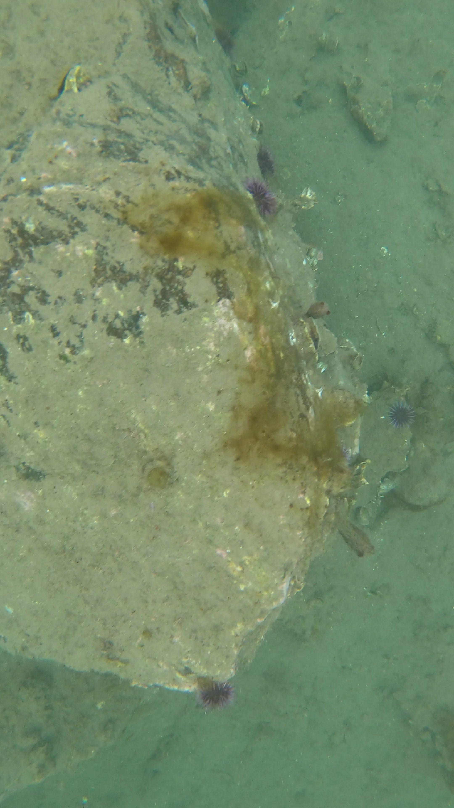
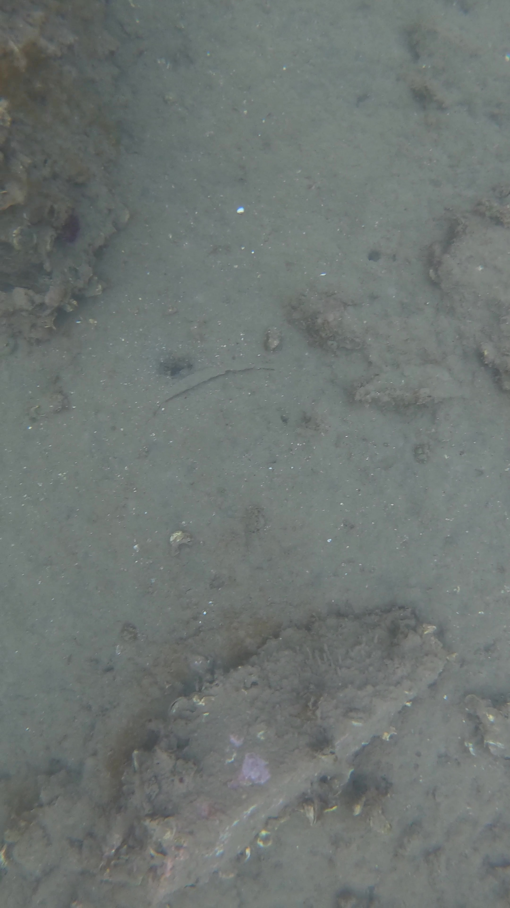

# JKS-Bot
Includes the code, 3D models, and dataset for the JKS-bot from the unlisted paper "Autonomous Solutions for Mapping Coral Reefs in Shallow Waters: The Efficacy  of a Low-Cost Alternative"

  
